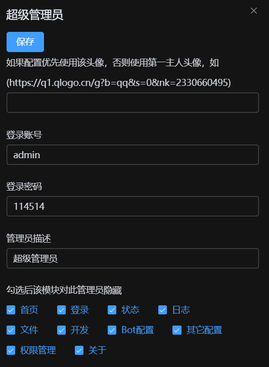
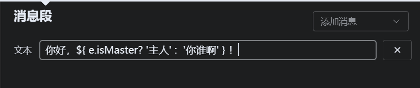
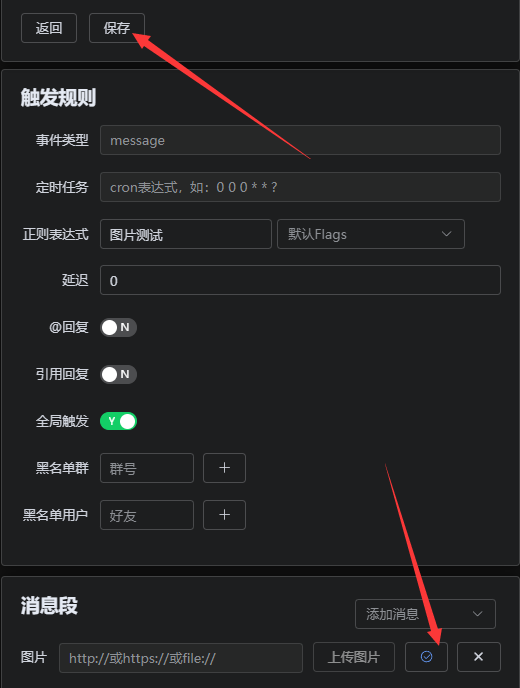

# Micro-Plugin 使用教程

## 登录

- 机器人运行后，插件会向第一个主人发送地址，该地址同时在终端打印。如果您在局域网环境运行，您可在浏览器打开内网地址访问控制台，如果应用部署在远程服务器，请访问公网地址。服务器端请务必设置安全组策略以开放默认端口号：23306


- 进入登录页,默认密码点进登录即可


- 首页您可以看到机器人的平台、用户统计等，我们首先来到左侧导航栏下的```其它```-->```权限管理```模块，这里您可以进行添加管理员，修改管理员登录信息


- 请第一时间修改默认账密，您还可以为管理员添加或隐藏某些导航栏的板块



## 添加一条指令

- 进入左侧导航栏下的```开发管理```-->```开发```模块，可以看到指令列表为空，我们点击添加指令：


- 输入正则表达式（触发词），flags默认即可
  


- 下滑到消息段，我们添加一条文本消息，```点击输入框```后，按下键盘符```/```，你将看弹出的消息事件变量模板，选择你需要的变量进行插入


- 变量自动插入到文本框内，当然您也可以按照图内的格式进行手动输入，之后点击保存！
  


- 此时您已经完成了一条基本的指令添加，您将看到如下效果：
  


- 当然，您可以使用任意符合javascript模板字符串的语法，使用更复杂的表达式判断消息，当然，前提是环境已经提供了这些变量：
  



## 制作图片

- 点击消息段选择框，选择图片，这里您可以直接输入图片的网址，或者点击上传图片。当然现在我们直接点击```在线制作```


- 您可看到一个简易的图片编辑器，你可以从左侧将组件拖动到画布，我们可以对这个组件进行编辑操作，当然可以直接插入图片，并拖动到合适位置，默认会为每个元素添加边框，您可手动输入边框宽度为0进行取消，当然也可点击右键进行图层类操作
  


- 编辑完图片务必点击预览，你将看到预览效果，并可以按需导出格式文件，这里我们点击保存到插件
  


- 保存后自动回到插件编辑页，您可以看到图片已制作完成标志


- 再次点击插件编辑页保存，之后你就可以测试效果啦
  


## 其它消息段

- 这里直接点点点就好，没有复杂的操作，需要注意的是这里所有添加的消息只作为一条消息发送，目的是可以图文混发，如果你同时添加语音和其它消息或是视频和其它消息类，将不被允许发送，具体实现取决于Yunzai的快速回复方法。如果您需要同一条指令发送多条消息，只要添加多条相同指令即可（这里我更愿意称作插件，未来将不会局限于message事件），您可以设置不同延时来调整发送顺序！
  
- 表情：
  


- 戳一戳


## 关于前端编译提交方式

- 前端和yunzaiV4版本使用了相似的环境，源码内置在插件fronted目录，为了不受到框架环境影响，请使用yarn工具来安装前端依赖！！！

- 如果你还没有yarn，请执行以下命令安装：
  ```sh
  npm i yarn -g
  ```
- 执行编译脚本：
  ```sh
  yarn run build
  ```
- 另外注意提交规范，否则无法提交成功！